# Relatorio - Comparacao de Tecnologias de Invocacao Remota

Trabalho de Computacao Distribuida sobre comparacao de tecnologias de invocacao remota por meio da implementacao de um servico fake de streaming de musicas.

Membros da equipe:

- Igor Gomes Ximenes - 2217665
- Gabril Abreu Cunha de Alencar - 2315097
- Kalil Smith Pinto Palheta - 2223857

## Observacoes Pos-Apresentacao

Depois da apresentacao, dois pontos foram revisados:

- **Java GraphQL respeitando campos solicitados:** a implementacao Java GraphQL foi ajustada para retornar apenas os campos pedidos na query. Antes, ao executar uma consulta como `{ musics { id name } }`, o Java ainda retornava `artist`. Agora o comportamento ficou igual ao GraphQL Python: se `artist` nao for solicitado, ele nao aparece na resposta.
- 

- **P95 e falhas do Python GraphQL em carga alta:** os graficos mostram P95 alto e algumas falhas no Python GraphQL alta. Isso foi conferido nos CSVs e esta coerente com os testes: as falhas foram `ConnectionRefusedError`, indicando saturacao do servidor sob 400 usuarios virtuais, nao foi erro de regra de negocio ou de query GraphQL. Na carga moderada, Python GraphQL teve 0 falhas; em Java GraphQL, as duas cargas tiveram 0 falhas.

## Resumo do Projeto

O projeto implementa o mesmo servico de streaming de musicas em 8 versoes diferentes, combinando 4 tecnologias de invocacao remota com 2 linguagens de programacao:

- REST
- gRPC
- GraphQL
- SOAP
- Python
- Java

## Massa de Dados

Todas as implementacoes inicializam os dados em memoria com o mesmo padrao:

| Recurso | Quantidade inicial | Campos |
|---|---:|---|
| Usuario | 250 | `id`, `name`, `age` |
| Musica | 500 | `id`, `name`, `artist` |
| Playlist | 400 | `id`, `name`, `userId`, `musicIds` |

Relacionamentos:

- Uma playlist pertence a um usuario por meio de `userId`.
- Uma playlist contem uma lista de musicas por meio de `musicIds`.
- As playlists sempre referenciam usuarios e musicas existentes.

Exemplo conceitual dos dados:

```json
{
  "user": {
    "id": 1,
    "name": "Usuario 1",
    "age": 19
  },
  "music": {
    "id": 1,
    "name": "Musica 1",
    "artist": "Banda Delta"
  },
  "playlist": {
    "id": 1,
    "name": "Playlist 1",
    "userId": 1,
    "musicIds": [8, 9, 10, 11, 12]
  }
}
```

## Implementacoes

| Linguagem | Tecnologia | Porta | Protocolo/Formato | Implementacao |
|---|---|---:|---|---|
| Python | REST | 8001 | HTTP + JSON | FastAPI |
| Python | gRPC | 8002 | HTTP/2 + Protobuf | grpcio |
| Python | GraphQL | 8003 | HTTP + JSON GraphQL | Strawberry |
| Python | SOAP | 8004 | HTTP + XML SOAP | Spyne |
| Java | REST | 8101 | HTTP + JSON | HttpServer da JDK |
| Java | gRPC | 8102 | HTTP/2 + Protobuf | grpc-java |
| Java | GraphQL | 8103 | HTTP + JSON GraphQL | HttpServer da JDK |
| Java | SOAP | 8104 | HTTP + XML SOAP | HttpServer da JDK |

Foram implementadas 8 versoes do mesmo servico, atendendo ao requisito de 4 tecnologias em pelo menos 2 linguagens.

## Estrutura do Repositorio

```text
python/rest       REST em Python
python/grpc       gRPC em Python
python/graphql    GraphQL em Python
python/soap       SOAP em Python

java/rest         REST em Java
java/grpc         gRPC em Java
java/graphql      GraphQL em Java
java/soap         SOAP em Java

shared            Documentacao do modelo
scripts           Scripts de setup, execucao e demonstracao
postman           Colecoes para demonstrar REST, GraphQL e SOAP
load-tests        Testes de carga
report/results    Resultados CSV/HTML e graficos
```

## Como Executar

O Java REST, GraphQL e SOAP usam a JDK. O Java gRPC usa Maven local instalado pelo script.

## Testes de Carga

Foram executadas duas cargas:

| Carga | Usuarios virtuais | Spawn rate | Duracao |
|---|---:|---:|---:|
| Moderada | 100 | 20 usuarios/s | 2 minutos |
| Alta | 400 | 80 usuarios/s | 2 minutos |

Fluxos simulados:

- Listar musicas.
- Consultar usuario.
- Criar playlist.
- Listar musicas de uma playlist.
- Listar playlists que contem uma musica.

Ferramentas:

- REST, GraphQL e SOAP: Locust.
- gRPC: gerador proprio baseado em threads, porque o cliente gRPC Python com Locust/gevent apresentou problemas de finalizacao em alguns testes.

Metricas coletadas:

- Requisicoes totais.
- Requisicoes por segundo.
- Tempo medio de resposta.
- Percentil 95.
- Falhas absolutas.
- Taxa de falha.

## Resultados Consolidados

| Implementacao | Requisicoes | Req/s | Tempo medio | P95 | Falhas | Taxa de falha |
|---|---:|---:|---:|---:|---:|---:|
| Python REST moderada | 24226 | 202.62 | 34.18 ms | 85 ms | 0 | 0.00% |
| Python REST alta | 25486 | 214.66 | 1373.36 ms | 1600 ms | 8 | 0.03% |
| Python gRPC moderada | 25279 | 209.27 | 3.51 ms | 4.94 ms | 0 | 0.00% |
| Python gRPC alta | 89450 | 740.03 | 63.19 ms | 324.37 ms | 0 | 0.00% |
| Python GraphQL moderada | 17903 | 150.96 | 198.42 ms | 340 ms | 0 | 0.00% |
| Python GraphQL alta | 16407 | 137.02 | 2394.58 ms | 2800 ms | 91 | 0.55% |
| Python SOAP moderada | 23312 | 196.51 | 49.19 ms | 520 ms | 0 | 0.00% |
| Python SOAP alta | 39471 | 329.81 | 735.38 ms | 2100 ms | 3638 | 9.22% |
| Java REST moderada | 25723 | 215.14 | 3.33 ms | 6 ms | 0 | 0.00% |
| Java REST alta | 86807 | 730.35 | 71.62 ms | 310 ms | 0 | 0.00% |
| Java gRPC moderada | 25531 | 211.46 | 1.43 ms | 2.24 ms | 0 | 0.00% |
| Java gRPC alta | 100890 | 835.18 | 2.77 ms | 5.55 ms | 0 | 0.00% |
| Java GraphQL moderada | 25497 | 214.91 | 3.16 ms | 5 ms | 0 | 0.00% |
| Java GraphQL alta | 95465 | 800.94 | 34.20 ms | 110 ms | 0 | 0.00% |
| Java SOAP moderada | 25541 | 215.22 | 3.45 ms | 6 ms | 0 | 0.00% |
| Java SOAP alta | 83188 | 695.97 | 95.35 ms | 370 ms | 0 | 0.00% |

## Graficos Gerais

### Requisicoes por Segundo

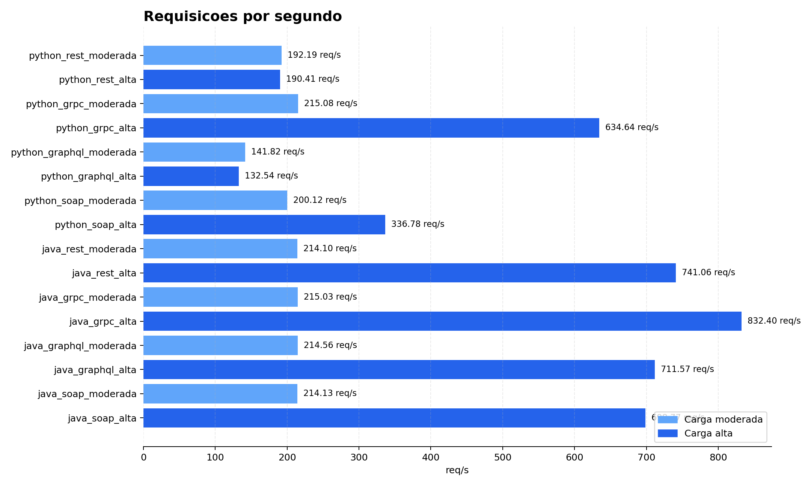

### Tempo Medio de Resposta

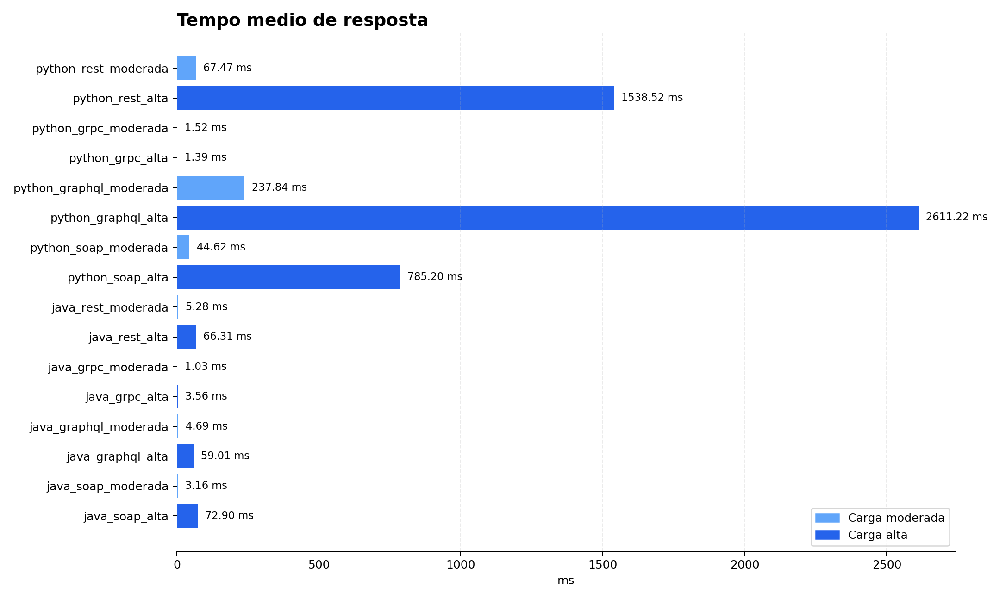

### Percentil 95

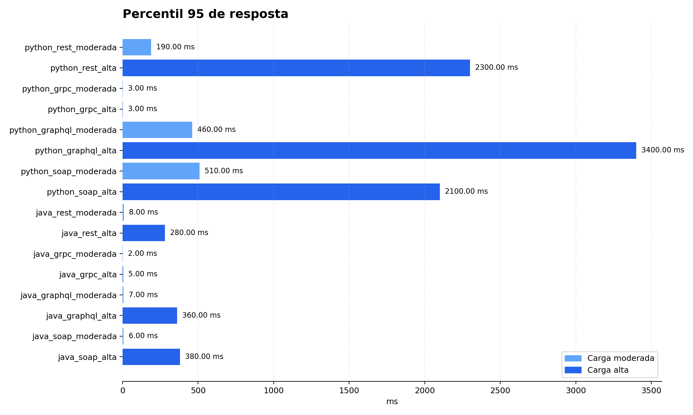

### Taxa de Falha

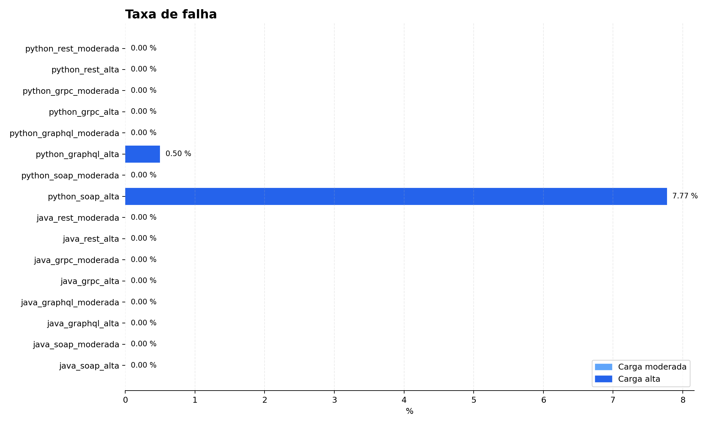

### Falhas Absolutas

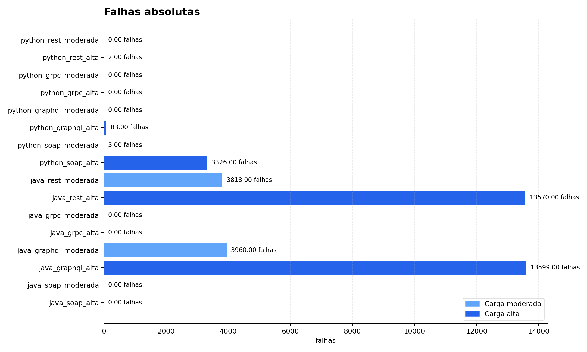

### Crescimento da Latencia

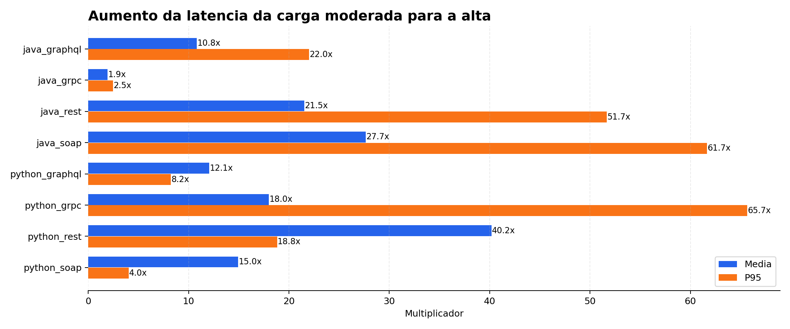

## Graficos por Sistema Remoto

Estes graficos comparam, para cada sistema remoto, os resultados das 4 combinacoes: Python moderada, Python alta, Java moderada e Java alta.

### Sistemas Remotos - Requisicoes por Segundo

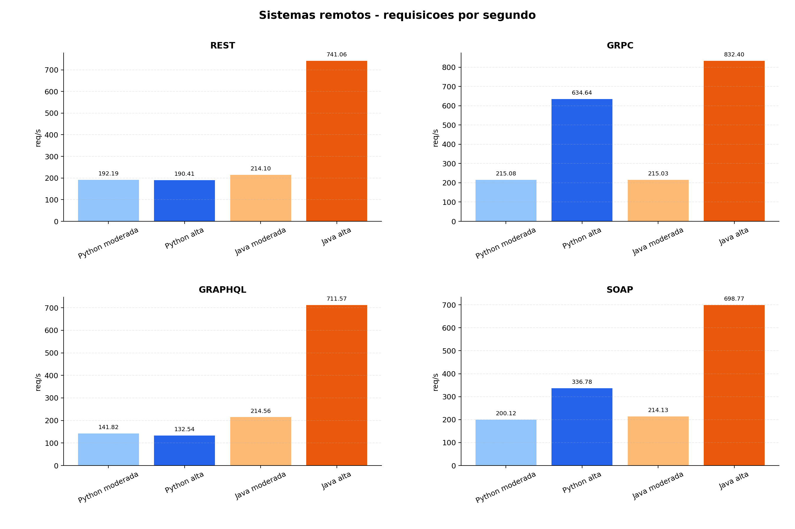

### Sistemas Remotos - Tempo Medio

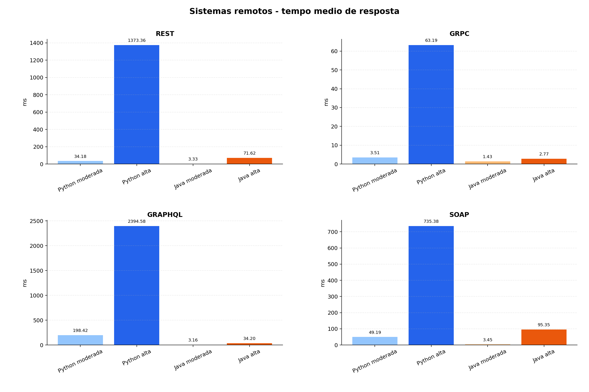

### Sistemas Remotos - Percentil 95

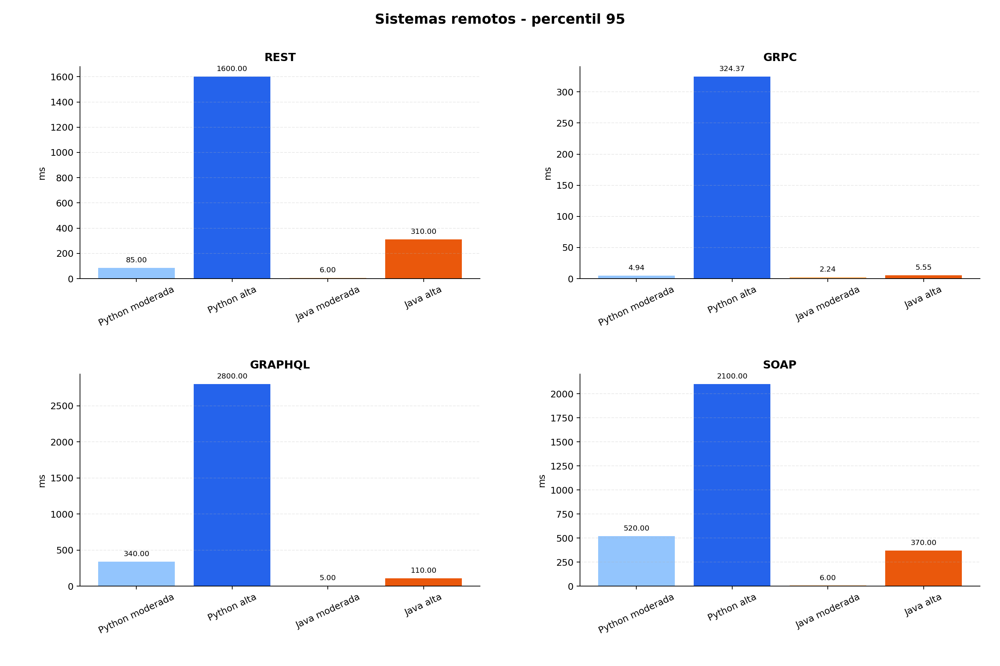

### Sistemas Remotos - Taxa de Falha

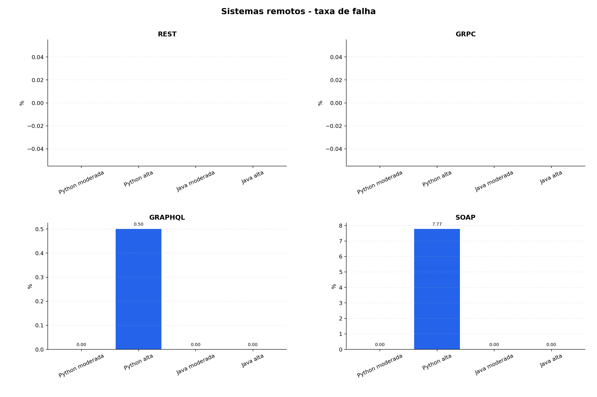

## Graficos por Linguagem

Estes graficos mostram qual tecnologia se destacou mais dentro de cada linguagem.

### Por Linguagem - Requisicoes por Segundo

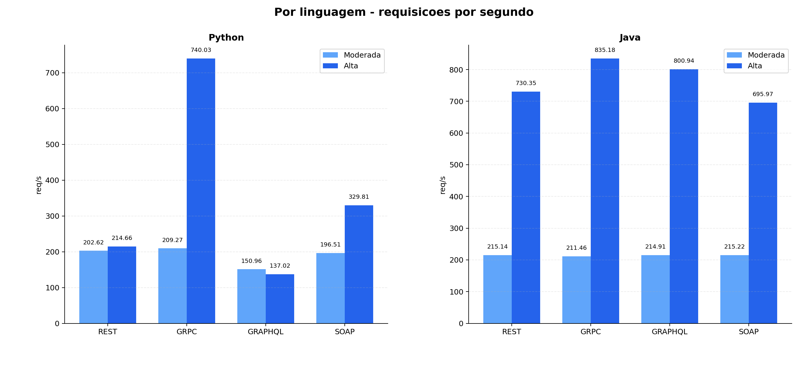

### Por Linguagem - Tempo Medio

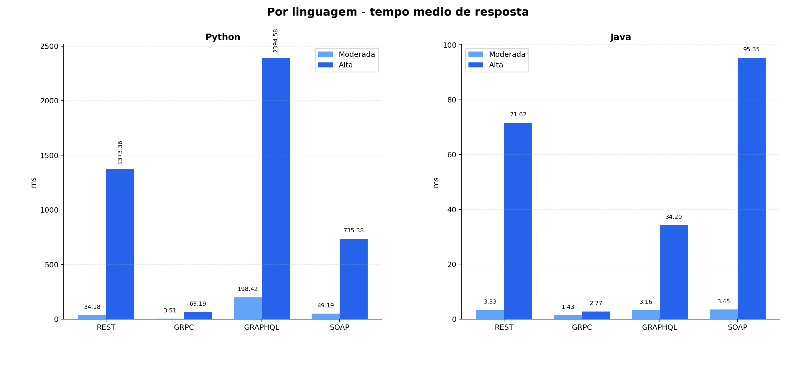

### Por Linguagem - Percentil 95

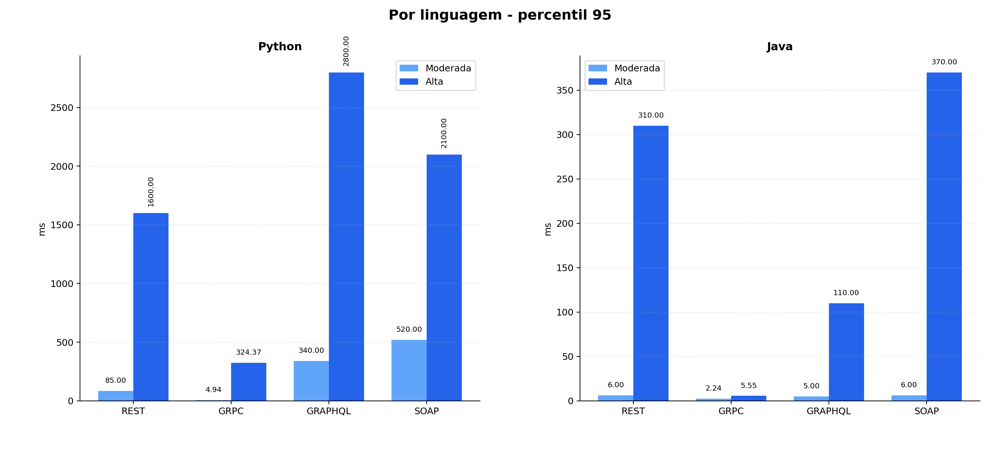

### Por Linguagem - Taxa de Falha

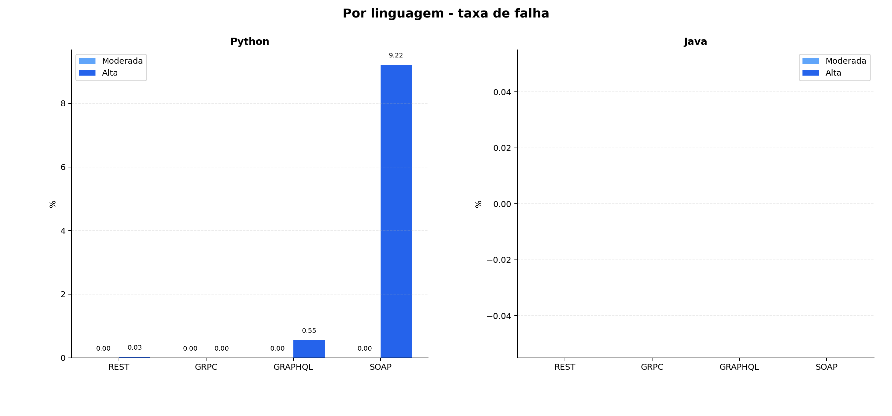

## Analise por Tecnologia

### REST

Resultados principais:

- Python REST moderada: 202.62 req/s, 34.18 ms, 0 falhas.
- Python REST alta: 214.66 req/s, 1373.36 ms, 8 falhas, 0.03%.
- Java REST moderada: 215.14 req/s, 3.33 ms, 0 falhas.
- Java REST alta: 730.35 req/s, 71.62 ms, 0 falhas.

Interpretacao:

- Em Python, REST se manteve funcional, mas a latencia subiu muito na carga alta e apareceram poucas falhas por conexao recusada. A taxa foi baixa, 0.03%, mas indica que o processo ficou proximo do limite sob 400 usuarios virtuais.
- Em Java, REST teve alta vazao e 0 falhas apos correcao do CRUD de playlists. A versao Java usa servidor HTTP simples da JDK, mas mesmo assim foi bem na carga alta.

### gRPC

gRPC foi o melhor resultado geral do trabalho.

Resultados principais:

- Python gRPC moderada: 209.27 req/s, 3.51 ms, 0 falhas.
- Python gRPC alta: 740.03 req/s, 63.19 ms, 0 falhas.
- Java gRPC moderada: 211.46 req/s, 1.43 ms, 0 falhas.
- Java gRPC alta: 835.18 req/s, 2.77 ms, 0 falhas.

Interpretacao:

- gRPC teve as melhores combinacoes de vazao, latencia e estabilidade.
- Protobuf reduz custo de serializacao.
- O canal gRPC persistente reduz overhead de conexao.
- Java gRPC foi o melhor resultado geral, com maior vazao e menor P95 na carga alta.
- Python gRPC teve latencia maior na nova rodada do que na anterior, mas continuou muito superior aos outros servicos Python na carga alta e manteve 0 falhas.

### GraphQL

GraphQL ofereceu a maior flexibilidade de consulta, mas teve custo maior no Python.

Resultados principais:

- Python GraphQL moderada: 150.96 req/s, 198.42 ms, 0 falhas.
- Python GraphQL alta: 137.02 req/s, 2394.58 ms, 91 falhas, 0.55%.
- Java GraphQL moderada: 214.91 req/s, 3.16 ms, 0 falhas.
- Java GraphQL alta: 800.94 req/s, 34.20 ms, 0 falhas.

Interpretacao:

- Em Python, GraphQL foi pesado sob carga alta porque cada requisicao precisa passar por parse da query, resolucao de campos e execucao de resolvers.
- Em Java, apos correcao do parser da query GraphQL no JSON, a implementacao ficou estavel e teve uma melhora forte na nova rodada.
- Mesmo em Java, GraphQL ficou com latencia maior que gRPC, o que e esperado pelo custo adicional de interpretacao das queries.

### SOAP

SOAP foi implementado com XML puro dentro do envelope SOAP. Os testes finais usam `text/xml` e respostas XML.

Resultados principais:

- Python SOAP moderada: 196.51 req/s, 49.19 ms, 0 falhas.
- Python SOAP alta: 329.81 req/s, 735.38 ms, 3638 falhas, 9.22%.
- Java SOAP moderada: 215.22 req/s, 3.45 ms, 0 falhas.
- Java SOAP alta: 695.97 req/s, 95.35 ms, 0 falhas.

Interpretacao:

- SOAP em Python sofreu na carga alta, com aumento de latencia e falhas. O resultado e coerente com o uso de XML puro, que exige mais CPU para montar e interpretar envelopes.
- O uso de XML aumenta o custo de parsing e serializacao.
- SOAP em Java ficou estavel, mas com latencia maior que gRPC, o que condiz com o overhead do XML.
- SOAP continua sendo adequado quando o contexto exige XML, contrato formal ou integracao com sistemas legados.

## Analise por Linguagem

### Python

Ranking na carga alta por desempenho geral:

| Tecnologia | Req/s | Tempo medio | P95 | Falhas |
|---|---:|---:|---:|---:|
| gRPC | 740.03 | 63.19 ms | 324.37 ms | 0 |
| SOAP | 329.81 | 735.38 ms | 2100 ms | 3638 |
| REST | 214.66 | 1373.36 ms | 1600 ms | 8 |
| GraphQL | 137.02 | 2394.58 ms | 2800 ms | 91 |

Melhor em Python: **gRPC**.

Motivos:

- Melhor equilibrio entre vazao, latencia e estabilidade na carga alta.
- Maior vazao.
- Nenhuma falha.
- Menor overhead de serializacao por usar Protobuf.

Observacoes:

- REST Python melhorou em relacao a rodada anterior, mas ainda enfileirou requisicoes na carga alta.
- GraphQL Python teve o maior custo de processamento.
- SOAP Python mostrou instabilidade com XML sob carga alta.

### Java

Ranking na carga alta por desempenho geral:

| Tecnologia | Req/s | Tempo medio | P95 | Falhas |
|---|---:|---:|---:|---:|
| gRPC | 835.18 | 2.77 ms | 5.55 ms | 0 |
| GraphQL | 800.94 | 34.20 ms | 110 ms | 0 |
| REST | 730.35 | 71.62 ms | 310 ms | 0 |
| SOAP | 695.97 | 95.35 ms | 370 ms | 0 |

Melhor em Java: **gRPC**.

Motivos:

- Maior vazao entre todas as implementacoes.
- P95 muito baixo.
- Nenhuma falha.
- Bom aproveitamento do runtime Java com comunicacao binaria.

Observacoes:

- REST Java tambem foi forte e simples de demonstrar.
- GraphQL Java ficou estavel apos correcao do parser e, na nova rodada, passou REST em vazao e latencia.
- SOAP Java mostrou que XML pode ser viavel quando o servidor lida bem com a carga, mas ainda ficou atras de gRPC.

## Melhores Resultados

Melhor resultado geral:

| Criterio | Melhor implementacao | Resultado |
|---|---|---|
| Maior vazao | Java gRPC alta | 835.18 req/s |
| Menor tempo medio | Java gRPC moderada | 1.43 ms |
| Menor P95 em carga alta | Java gRPC alta | 5.55 ms |
| Melhor estabilidade | gRPC Python e Java | 0 falhas |
| Melhor para demonstrar CRUD | REST | Chamadas HTTP simples |
| Melhor em Python | Python gRPC | 740.03 req/s, 63.19 ms |
| Melhor em Java | Java gRPC | 835.18 req/s, 2.77 ms |

Conclusao sobre os melhores:

- **gRPC foi a melhor tecnologia em desempenho e estabilidade.**
- **REST foi a melhor tecnologia para demonstracao manual do CRUD.**
- **GraphQL foi a melhor em flexibilidade de consulta, mas nao em desempenho no Python.**
- **SOAP foi a melhor representacao de integracao formal/legada com XML, mas teve overhead maior.**

## Conclusao

O trabalho implementou o mesmo servico em 8 versoes equivalentes, usando 4 tecnologias de invocacao remota e 2 linguagens.

Todas as versoes implementam CRUD de usuarios, musicas e playlists, consultas relacionais e massa de dados inicial com centenas de registros.

Os testes mostram que a diferenca entre tecnologias aparece principalmente quando a carga aumenta:

- gRPC teve melhor desempenho geral.
- REST foi simples, funcional e excelente para demonstracao.
- GraphQL trouxe flexibilidade, mas com custo de processamento maior.
- SOAP demonstrou o custo do XML e a importancia de implementacao eficiente.

A escolha ideal depende do objetivo:

- APIs simples e publicas: REST.
- Comunicacao interna de alto desempenho: gRPC.
- Consultas flexiveis para clientes diferentes: GraphQL.
- Integracoes formais ou legadas baseadas em XML: SOAP.

No contexto dos testes realizados, **gRPC foi o vencedor tecnico**.
